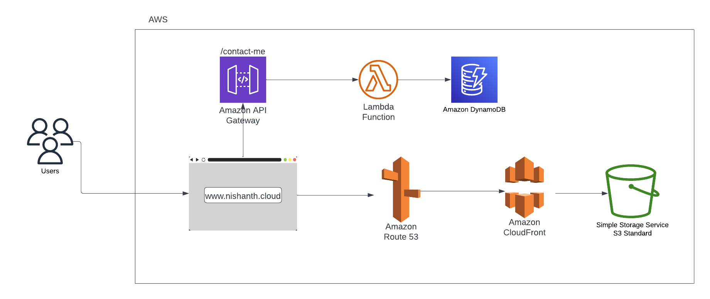

# Nishanth-Gowda-Portfolio

This is a resume portfolio website created using HTML, CSS, JavaScript, and Typed.js. The website is designed to showcase my skills and experience as a Cloud Engineer and provide a platform to share my work and projects. You can access the site using the url: www.nishanth.cloud

<h2>Project Architecture</h2>

<h2>Tech Stack</h2>

- <b>S3</b>
  - Amazon S3 (Simple Storage Service) is an object storage service that offers industry-leading scalability, data availability, security, and performance.
- <b>AWS CloudFront</b>
  - Amazon CloudFront is a fast content delivery network (CDN) service that securely delivers data, videos, applications, and APIs to customers globally with low latency, high transfer speeds, all within a developer-friendly environment.
- <b>AWS Certificate Manager</b>
  - AWS Certificate Manager is a service that lets you easily provision, manage, and deploy public and private Secure Sockets Layer/Transport Layer Security (SSL/TLS) certificates for use with AWS services and your internal connected resources.
- <b>AWS Lambda</b>
  - AWS Lambda is a serverless compute service that lets you run code without provisioning or managing servers, creating workload-aware cluster scaling logic, maintaining event integrations, or managing runtimes. With Lambda, you can run code for virtually any type of application or backend service.
- <b>DynamoDB</b>
  - Amazon DynamoDB is a key-value and document database that delivers single-digit millisecond performance at any scale. It's a fully managed, multi-region, multi-master, durable database with built-in security, backup and restore, and in-memory caching for internet-scale applications.
- <b>Amazon API Gateway</b>
  - Amazon API Gateway is a fully managed service that makes it easy for developers to create, publish, maintain, monitor, and secure APIs at any scale. With API Gateway, you can create RESTful APIs that enable real-time two-way communication applications. 
- <b>AWS Route 53</b>
  - AWS Route 53 is a highly available and scalable Domain Name System (DNS) web service that provides developers and businesses with a reliable and cost-effective way to route end users to Internet applications by translating human-readable domain names into IP addresses. 

<h2>Hosting On AWS</h2>

My portfolio website is hosted on AWS using Route53, CloudFront, and S3. The website is served over HTTPS using a custom domain name. The website is built using HTML, CSS, and JavaScript and is designed to be responsive across different devices.

The contact form on the website allows users to send me a message with their name, email address, and a message. When a user submits the contact form, the data is sent to API Gateway, which invokes a Lambda function. The Lambda function stores the data in DynamoDB.

The code for the Lambda function is written in Python using boto3 library and uses the AWS SDK to interact with DynamoDB. The DynamoDB table is configured to have a primary key of email, which ensures that duplicate entries are not created.

<h2>Installation</h2>
To deploy this website, you'll need an AWS account and the AWS CLI installed on your local machine. You can use the following steps to deploy the website:

1. Clone the repository to your local machine.
2. Create an S3 bucket to host the website files.
3. Configure the S3 bucket to act as a static website host and enable website hosting.
4. Upload the website files to the S3 bucket.
5. Create a CloudFront distribution to serve the website content.
6. Update the DNS records for your domain name to point to the CloudFront distribution.
7. Create an API Gateway and a Lambda function to handle form submissions.
8. Configure the API Gateway to invoke the Lambda function when a form is submitted.
9. Create a DynamoDB table to store the form data.
10. Grant the Lambda function permission to access the DynamoDB table.

<h2>Credits</h2>

The website is built using an open-source project from Lucas Angelo as a starting point. This project was bootstrapped using the latest web development technologies and tools such as HTML, CSS, and JavaScript.

Link to Lucas Angelo GitHub Repo: https://github.com/Lucas-Angelo/portfolio

Thank you for visiting my website, and I hope you enjoy exploring my work and projects. If you have any questions or feedback, please feel free to contact me.

